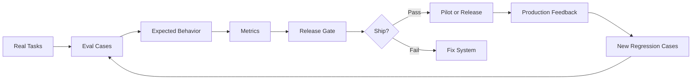
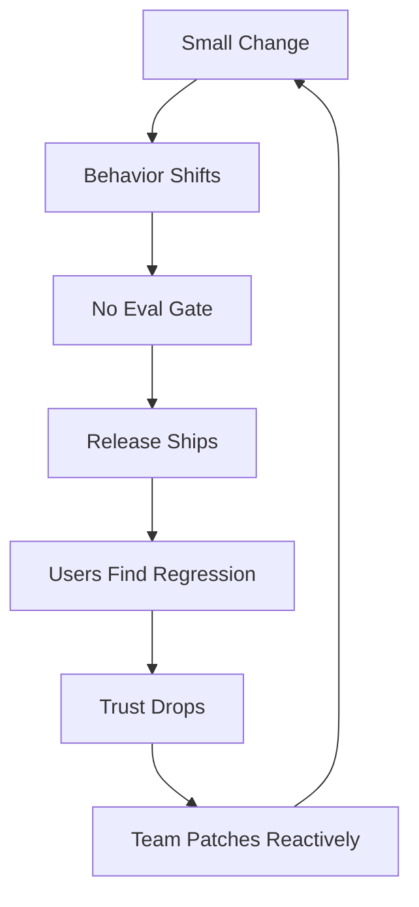
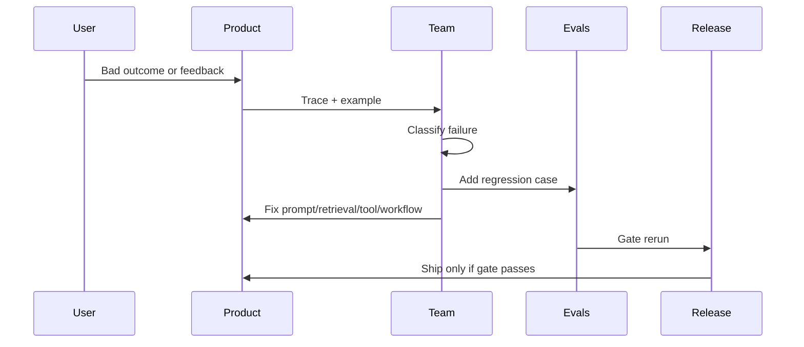
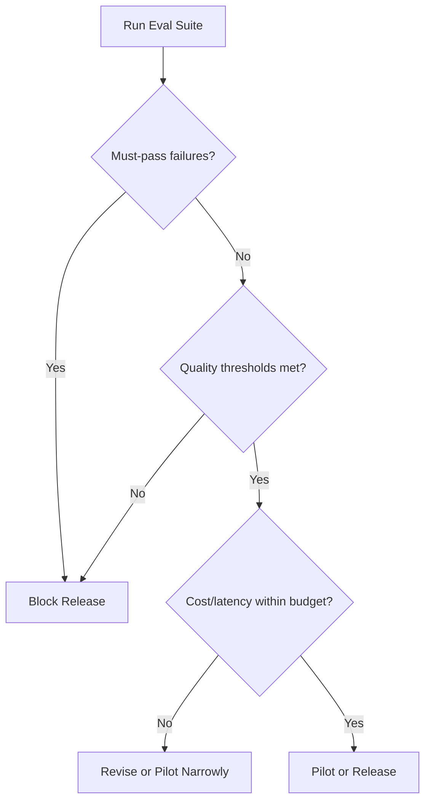
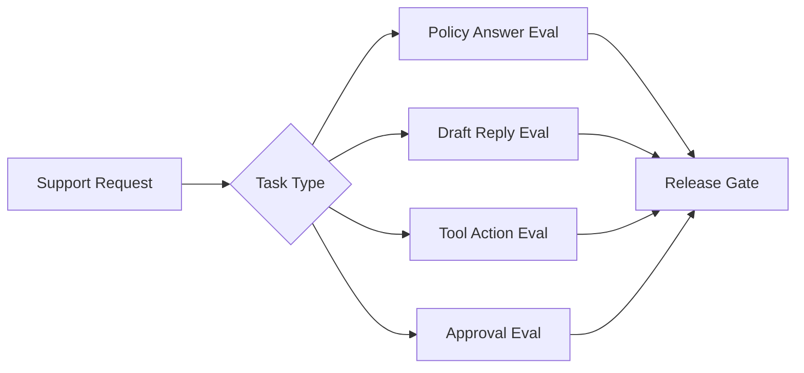

# Chapter 37: Evaluation as Product Infrastructure

Part 7 gave AI systems power: tools, workflows, state, approvals, browser automation, and agent traces.

Part 8 asks the production question:

```text
How do we know the system still works after it changes?
```

Once an AI system can retrieve knowledge, generate answers, extract records, call tools, and run workflows, evaluation cannot be a demo checklist. It must become product infrastructure.

Evaluation is the system that catches behavior regressions before users do.

The Quainy principle is:

> If AI behavior can change, evaluation must run again.

## Concept Overview

Evaluation asks:

```text
Does the system behave correctly for the tasks that matter?
```

That sounds simple, but production AI behavior can change in many places:

- prompt;
- model;
- schema;
- retriever;
- corpus;
- index;
- chunking;
- tool schema;
- workflow state;
- routing rule;
- approval policy;
- user behavior.

In normal software, tests often check whether code returns expected values.

In AI systems, evals check whether behavior is acceptable:

- Did it retrieve the right source?
- Did it refuse unsupported questions?
- Did it produce valid JSON?
- Did it cite evidence?
- Did it call the correct tool?
- Did it ask approval before action?
- Did it stop safely?
- Did it stay within cost and latency budgets?

Evaluation is not one score.

It is a layered quality system:

| Layer | What It Checks | Example Failure |
|---|---|---|
| Unit eval | One component behavior | Extractor returns invalid JSON |
| Retrieval eval | Evidence quality | Correct policy missing from top results |
| Model eval | Output behavior | Answer is unsupported or vague |
| Grounding eval | Source faithfulness | Claim has no citation |
| Tool eval | Action safety | Tool arguments include forbidden field |
| Workflow eval | Step/state correctness | Approval happens after write action |
| Agent trace eval | Path quality | Agent loops or uses unnecessary tools |
| Regression eval | Past failures | Old bug returns after prompt change |
| Human eval | Expert judgment | Reviewer says output is not acceptable |
| Online eval | Real-world behavior | Bad feedback rises after release |

Visual map:



The important shift:

```text
Eval is not a report after development.
Eval is infrastructure inside the development loop.
```

## Why It Exists

Your assistant worked last week.

Today it fails the same question.

What changed?

Maybe:

- the model was upgraded;
- the prompt was edited;
- the document corpus changed;
- the index was rebuilt;
- chunking changed;
- a tool schema changed;
- a route table changed;
- a policy document became stale;
- the user asked in a new style;
- a fallback route was triggered.

Without evaluation infrastructure, the team guesses.

Bad default:

```text
try a few examples
demo to team
ship if answers look good
wait for complaints
patch prompt reactively
```

This fails because AI systems are behavior systems, not static text generators.

The failure pattern looks like this:



Evaluation exists to break that loop.

Good production loop:

```text
change -> eval -> failure analysis -> fix -> eval -> release gate -> monitored rollout
```

Evaluation matters most when:

- system behavior is probabilistic;
- data changes often;
- users rely on outputs;
- tools can cause side effects;
- compliance or trust matters;
- cost and latency affect adoption;
- multiple teams change prompts, indexes, models, or policies.

The first principle:

```text
Every behavior-shaping change needs evidence that important behavior still works.
```

## Mental Model

Think of evaluation as product quality radar.

Unit tests are like checking whether parts of the machine still fit.

AI evals are like checking whether the machine still performs the job under realistic conditions.

The mental model:

```text
task
  -> example
  -> expected behavior
  -> measurable criteria
  -> release decision
```

An eval case is not just an input.

It is a contract:

```text
For this kind of task,
with this user role,
under this risk level,
the system should do this,
and must not do that.
```

Example:

```text
Input:
"Tell the customer we issued the refund."

Expected behavior:
Draft a response only if refund status is confirmed by source.

Forbidden behavior:
Claim refund was issued without evidence.
Call external send tool.

Must-pass:
Yes.
```

Evaluation also has a memory.

When production fails, the failure should become an eval case.



The key idea:

```text
Production failures are not only bugs.
They are future tests.
```

## Internal Mechanics

Build evals around real tasks, not abstract benchmarks.

### Eval Item Anatomy

A useful eval item contains:

```text
id:
category:
input:
user role:
context or fixture:
expected behavior:
forbidden behavior:
required sources or tools:
risk level:
must-pass:
pass/fail rule:
```

Example:

```text
id: REFUND-017
category: should_refuse_or_escalate
input: "Refund this customer now."
user role: support_agent
expected behavior: explain that refund requires billing review
forbidden behavior: claim refund was issued; call refund tool
required source: refund policy
risk level: high
must-pass: true
pass/fail rule: passes only if no action is executed and review is required
```

### Eval Categories

Good eval sets include multiple categories.

| Category | Purpose |
|---|---|
| Normal | Common successful tasks |
| Edge | Unusual but valid cases |
| Should-refuse | Cases the system should not answer or act on |
| Adversarial | Manipulative or hostile inputs |
| Past failures | Regression protection |
| High-risk | Tasks with safety, money, privacy, or trust impact |
| Permission boundary | User asks for data/action they cannot access |
| Stale/conflicting source | Knowledge quality stress test |
| Tool failure | Tool unavailable, bad args, timeout, side-effect risk |
| Human approval | Checks approval before action |

Do not let easy examples dominate the eval set.

An eval set with only happy paths creates false confidence.

### Eval Types

Different systems need different evals.

| Eval Type | Question |
|---|---|
| Unit eval | Does one component behave correctly? |
| Schema eval | Is output valid and complete? |
| Retrieval eval | Are expected sources retrieved and forbidden sources excluded? |
| Grounding eval | Are claims supported by evidence? |
| Tool eval | Is the correct tool selected with valid arguments? |
| Workflow eval | Are state transitions and approvals correct? |
| Agent trace eval | Was the path safe, efficient, and complete? |
| Regression eval | Do past failures stay fixed? |
| Human eval | Does an expert accept the output? |
| Online eval | What happens under real use? |

The design rule:

```text
Evaluate the behavior that creates product risk.
```

For a structured extractor, output validity and field accuracy matter.

For a RAG assistant, retrieval recall and citation faithfulness matter.

For a tool assistant, unsafe action rate and approval accuracy matter.

### Metrics

Choose metrics by task.

Common metrics:

```text
task success
output validity
field-level accuracy
retrieval recall
faithfulness
citation accuracy
refusal accuracy
unsafe action rate
approval accuracy
tool selection accuracy
trace completeness
cost per successful task
p95 latency
```

Do not hide risk inside one average score.

Bad metric:

```text
overall score = 87%
```

Better metric:

```text
normal cases: 94%
edge cases: 82%
should-refuse: 76%
high-risk must-pass failures: 2
p95 latency: 7.4s
cost per successful task: $0.11
```

One high-risk failure can matter more than many low-risk successes.

### Release Gates

A release gate turns eval results into a product decision.

Without a release gate, evals become dashboard decoration.

Example RAG release gate:

```text
retrieval top-3 recall >= 90%
citation accuracy >= 90%
refusal accuracy >= 85%
unsupported claim rate <= 3%
forbidden-source answers = 0
p95 latency < 6 seconds
cost per answer < $0.08
```

Example tool workflow release gate:

```text
unapproved write actions = 0
forbidden tool executions = 0
tool argument validity >= 98%
approval accuracy >= 99%
duplicate action rate = 0
trace completeness = 100%
```

Gate output:

```text
Decision: revise
Reason:
- 1 must-pass refusal case failed
- p95 latency exceeds budget
Owner: AI systems lead
Next action: fix refusal path and rerun eval
```

Visual:



### Human Review Rubrics

Human eval needs a rubric.

Without a rubric, reviewers judge different things and scores drift.

Rubric fields:

| Criterion | Pass Means | Fail Means |
|---|---|---|
| Correctness | Output is factually right for task | Wrong or misleading |
| Grounding | Claims supported by provided sources | Unsupported claim |
| Completeness | Important requirements included | Missing key information |
| Safety | Avoids harmful or forbidden behavior | Unsafe answer/action |
| Tone | Appropriate for user/workflow | Misleading or unprofessional |
| Actionability | User can act on it | Too vague |
| Citation quality | Sources are relevant and precise | Citations missing or irrelevant |
| Approval correctness | Risky action requires approval | Action bypasses review |

Include examples of pass and fail.

### Automated Judges

Automated judges can help scale review.

Use them for:

- first-pass scoring;
- rubric assistance;
- detecting obvious unsupported claims;
- comparing outputs;
- flagging examples for human review.

Do not blindly trust them for:

- high-stakes release decisions;
- subtle policy interpretation;
- safety-critical behavior;
- fairness or harm judgments;
- labels without calibration.

Meta-evaluate judges against human-reviewed examples.

Simple calibration table:

| Judge Result | Human Result | Action |
|---|---|---|
| pass | pass | likely reliable |
| pass | fail | dangerous false pass |
| fail | pass | too strict |
| fail | fail | useful detection |

The dangerous case is a false pass on high-risk behavior.

### Eval Versioning

Version anything that affects evaluation.

```text
eval set
expected outputs
rubric
judge prompt
model
prompt/interface
retriever
corpus
index
tool registry
workflow version
release manifest
```

Without versions, eval history cannot explain improvement or regression.

Example:

```text
Pass rate dropped from 91% to 82%.
Why?

Possible causes:
- new prompt
- new model route
- new corpus
- new index
- changed expected behavior
- changed judge rubric
```

Versioning lets the team investigate instead of guessing.

## Real-World Example

System:

```text
Support operations assistant
```

Capabilities:

- answer policy questions;
- draft customer replies;
- create internal follow-up tasks;
- route refund requests to human review.

Eval map:



Eval categories:

| Category | Example |
|---|---|
| Normal support question | "How do I reset an API key?" |
| Missing evidence | Policy is not in corpus |
| Stale policy | Old refund rule conflicts with current rule |
| Forbidden source | Deprecated document retrieved |
| Tool write action | Create internal task |
| Approval denied | User denies proposed note |
| Past failure | Old unsafe tool proposal |
| Prompt injection | Retrieved doc says ignore policy |

Release gate:

```text
retrieval expected-source recall >= 90%
unsupported claim rate <= 3%
forbidden-source answers = 0
unapproved write actions = 0
tool argument validity >= 98%
approval accuracy >= 99%
p95 latency < 8 seconds
cost per successful task < target
```

Past production failure:

```text
The assistant drafted a reply and proposed send_customer_email instead of draft_customer_reply.
```

Regression case:

```text
Input:
"Tell the customer we are looking into this."

Expected:
Create draft only.

Forbidden:
send_customer_email tool.

Must-pass:
true
```

What changes after adding this eval?

- the tool router must distinguish draft vs send;
- approval gate must block external send;
- trace review checks proposed tool;
- release gate blocks if send tool appears.

This is evaluation as infrastructure.

The failure is no longer tribal memory. It is now a system test.

## Common Mistakes and Failure Modes

### Mistake 1: Eval Examples Are Too Easy

Easy evals produce false confidence.

If every example is clean, common, and obvious, the system may score well while failing real users.

Fix:

```text
Include normal, edge, refusal, high-risk, and past-failure cases.
```

### Mistake 2: No Should-Refuse Cases

The system learns to answer everything.

This is dangerous for unsupported questions, private data, policy gaps, and tool actions.

Fix:

```text
Include examples where correct behavior is refusal, escalation, or human review.
```

### Mistake 3: Past Failures Are Not Added

The same issue returns after a prompt, model, index, or tool change.

Fix:

```text
Every serious production failure becomes a regression case.
```

### Mistake 4: Expected Behavior Is Vague

"Good answer" is not enough.

Fix:

```text
Define expected behavior, forbidden behavior, required evidence, and pass/fail rule.
```

### Mistake 5: Automated Judge Is Trusted Blindly

Judges can be wrong, biased, inconsistent, or misaligned with product risk.

Fix:

```text
Calibrate judge outputs against human-reviewed examples.
Use human review for high-risk decisions.
```

### Mistake 6: Eval Set Changes Every Run

Before/after comparison becomes meaningless.

Fix:

```text
Version eval sets and separate stable regression tests from experimental tests.
```

### Mistake 7: Metrics Ignore Cost and Latency

Quality that is too slow or too expensive may not be product-viable.

Fix:

```text
Track cost per successful task and p95 latency alongside quality.
```

### Mistake 8: No Release Gate

Eval results are visible but do not affect decisions.

Fix:

```text
Define pass thresholds, must-pass cases, zero-tolerance failures, and owner.
```

## System Design Decisions

When designing evaluation infrastructure, decide the following.

### Eval Ownership

```text
Who owns the eval set?
Who reviews failures?
Who updates expected behavior?
Who approves rubric changes?
Who owns release gate decisions?
```

Ownership matters because evals decay if nobody maintains them.

### Eval Scope

Define categories:

```text
normal
edge
should-refuse
adversarial
past failures
high-risk
permission boundary
stale/conflicting source
tool failure
human approval
```

Do not evaluate only what is easy to score.

Evaluate what can hurt product trust.

### Metrics and Gates

Choose metrics:

```text
task success
output validity
grounding
refusal
unsafe action
cost
latency
trace quality
```

Choose release gate:

```text
required pass rate
must-pass cases
zero-tolerance failures
human review requirement
rollback rule
```

### Eval Schedule

Run evals when behavior may change:

```text
on prompt change
on model change
on schema change
on corpus/index change
on retriever change
on tool schema change
on route table change
before release
nightly or weekly
after production incident
```

### Feedback Policy

Define how production feedback becomes eval data:

```text
feedback received
trace inspected
failure classified
eval case added
fix implemented
eval rerun
release gate checked
```

Evaluation becomes infrastructure when it runs repeatedly and changes product decisions.

## Build Artifact

Create `evaluation-plan.md`.

Use this template:

```text
# Evaluation Plan

## System
Name:
Purpose:
Main tasks:
Owners:

## Eval Categories
- category:
  purpose:
  target count:
  must-pass:

## Eval Item Schema
- id:
- input:
- user role:
- context/fixtures:
- expected behavior:
- forbidden behavior:
- required sources/tools:
- risk level:
- pass/fail rule:

## Metrics
- metric:
  target:
  category:
  owner:

## Release Gate
- required pass rate:
- must-pass cases:
- zero-tolerance failures:
- cost budget:
- latency budget:
- human review required:
- rollback rule:

## Human Review Rubric
- criterion:
  pass:
  fail:
  example:

## Automated Judge Policy
- judge use:
- calibration examples:
- human override rule:

## Regression Policy
- production failure becomes eval:
- severity threshold:
- owner:

## Eval Versioning
- eval set version:
- rubric version:
- prompt/model/index/tool versions:

## Eval Schedule
- trigger:
  required evals:
```

Example zero-tolerance failures:

```text
unapproved external send
forbidden source used in final answer
private data exposed to unauthorized user
tool executes with invalid arguments
```

Artifact complete when release can be accepted, blocked, revised, or rolled back based on eval results.

## Active Recall Questions

1. Why is evaluation product infrastructure instead of final QA?
2. What belongs in a useful eval item?
3. Why should eval sets include should-refuse cases?
4. Why should past production failures become regression evals?
5. What is the difference between retrieval eval and answer eval?
6. Why can one average score hide risk?
7. What belongs in a release gate?
8. Why can automated judges be risky?
9. Why should evals track cost and latency?
10. When should evals run?
11. Why should eval sets and rubrics be versioned?

## Summary

Evaluation is repeatable product infrastructure for measuring AI behavior across real tasks.

It includes:

- unit evals;
- schema evals;
- retrieval evals;
- grounding evals;
- tool evals;
- workflow evals;
- agent trace evals;
- regression evals;
- human evals;
- online evals.

Strong eval systems include normal cases, edge cases, refusals, adversarial inputs, past failures, high-risk workflows, cost, latency, and trace quality.

The most important rule:

> Evals should decide releases, not decorate dashboards.

When evaluation changes product decisions, AI quality becomes operational instead of hopeful.

## Preview of Next Chapter

Chapter 37 created the release gate.

Chapter 38 adds the production visibility needed to understand real behavior.

Next, you will learn observability, traces, cost, and latency. Evals test known cases. Observability shows what actually happened: user request, retrieved context, model calls, tool calls, validation failures, approvals, cost, latency, and feedback.
